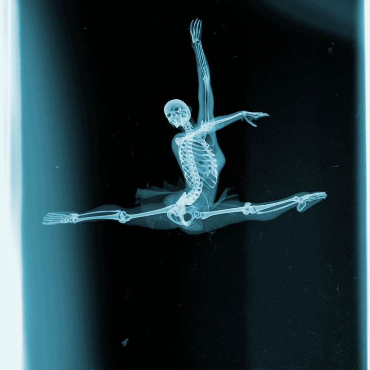
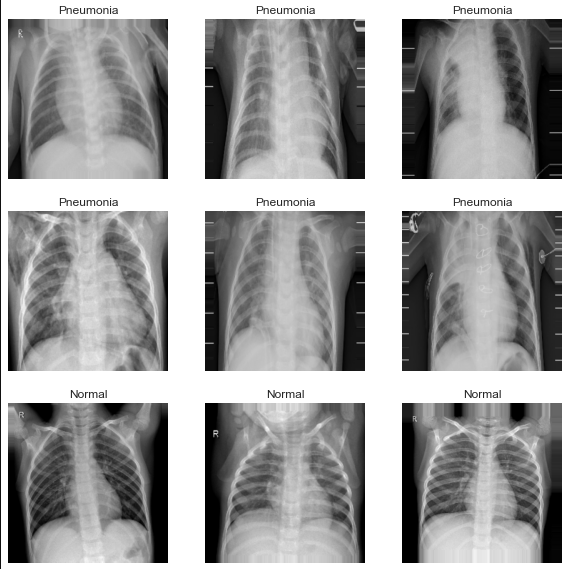

# X-Ray Pneumonia Classification

**By**: Andrew Bernklau, Carlos McCrum, Jared Mitchell

#### Preview Deployment: https://share.streamlit.io/281clo/x-ray-pneumonia-classification/main/deploy.py


## Overview
The goal of this project is to create an image classification model that can successfully classify between X-rays of uninfected and infected lungs. The data set we're using is a set of five and a half thousand X-ray images from Guangzhou Women and Children’s Medical Center. The data has around a four to one ratio between infected lung images and uninfected lung images. After testing a few models, the model that we chose to use was a Convolutional neural network (CNN).

## Business Problem
With most datasets focusing on adults and with almost 2 million deaths a year contributed from pneumonia cases in children, it is important to find accurate classification to identify and treat as soon as possible. The goal of our project is to build an image classification model that can correctly identify between x-rays of infected and healthy lungs. It's important that our model has high accuracy. With a low accuracy our model would misdiagnose too much. 



## Data
Our data was five and a half thousand pediatric X-ray images from Guangzhou Women and Children’s Medical Center. Our data was also consensually and ethically obtained. The data did contain some significant class imbalance. We had four times as many images of infected lungs compared to images of uninfected lungs.

## Methods

Our model was a CNN model. The way this model works is by taking our input image, then running that image through the tuned layers of the model, and then outputs a classification for the image. Image classification models work better with more images, so we used image augmentation within our model to effectively train it on more images without actually collecting more X-rays. This ended up being very helpful with our models' accuracy. 


## Results
The final accuracy of our model was 91%. We're pretty confident in our model's outcome, and are confident that it could be used to help screen patients X-rays. That being said, it can't be used as a stand alone tool. The model would misdiagnose too many patients if used alone.  

## Conclusions
We recommend our model be used in tandem with a doctor's opinion. The model could act as a second check to support the doctor and even catch misdiagnoses from the doctor. If we wanted our model to get even closer to 100% accuracy then we would need more data. With the limited amount of images we did it was challenging to properly train the model. On top of that, getting some demographic info on each patient could be very helpful for our model as well. Things like pre-existing conditions and other possible risk factors for pneumonia. 
## For More Information

Please review our full analysis in [our Jupyter Notebook](https://github.com/281clo/X-Ray-Pneumonia-Classification/blob/main/Draft_Notebook.ipynb) or our [presentation](https://docs.google.com/presentation/d/1xeCiQLU2krOBAP_BNpBU9bXrcZJKGTksFrjdiuqu_Ck/edit?usp=sharing).

Kermany, Daniel; Zhang, Kang; Goldbaum, Michael (2018), “Labeled Optical Coherence Tomography (OCT) and Chest X-Ray Images for Classification”, Mendeley Data, v2

## Repository Structure

```
├── code                                <- Folder containing preparation of data and visuals
├── data                                <- Folder containing all X-ray images used  
├── images                              <- Folder containing images used in the notebook 
├── Final_Notebook.ipynb                <- Final notebook
├── README.md                           <- The file you're currently reading from
```
